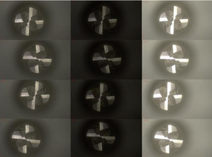
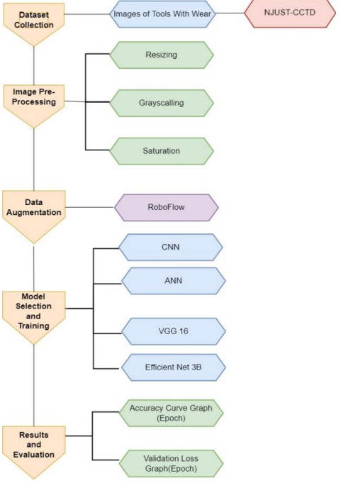

# Milling Tool Wear Detection

This project leverages deep learning and computer vision techniques to classify the wear state of milling tools. The goal is to provide an efficient solution for real-time monitoring and predictive maintenance in manufacturing, which can reduce downtime and ensure high-quality output.

## Table of Contents
- [Project Overview](#project-overview)
- [Motivation](#motivation)
- [Methodology](#methodology)
- [Models Used](#models-used)
- [Use Cases](#use-cases)
- [About NJUST-CCTD](#about-njust-cctd)
- [Dataset](#dataset)
- [Project Structure](#project-structure)
- [Installation](#installation)
- [Usage](#usage)
- [Results and Accuracies](#results-and-accuracies)
- [Technologies Used](#technologies-used)
- [Future Improvements](#future-improvements)
- [Acknowledgments](#acknowledgments)

---

## Project Overview

The project detects wear on milling tools by analyzing images of the tool surface using deep learning models. By classifying the wear level, we enable proactive maintenance, which is essential for high-volume and high-precision manufacturing environments. This classification is performed as:
1. **Two-Class Classification** - Identifying whether the tool has `No tool wear` or `Tool wear`.
2. **Three-Class Classification** - Categorizing wear level as `Severe tool wear`, `Mild tool wear`, or `No tool wear`.

The following deep learning models were used to achieve the results:
- **CNN (Convolutional Neural Network)**
- **VGG16** for feature extraction
- **Elastic Net** and **DSSNet** for improved regularization and model performance.

## Motivation

Milling tool wear detection is critical in manufacturing for maintaining tool health and ensuring product quality. As tools wear down over time, they produce parts with lower precision, affecting quality and causing potential delays due to unforeseen maintenance requirements. By monitoring the wear state, manufacturers can:
- Reduce costs associated with tool replacement and machine downtime.
- Improve product quality by ensuring that only well-conditioned tools are used in production.
- Enhance productivity with predictive maintenance strategies, scheduling tool changes only when necessary.

## Methodology

1. **Data Preprocessing**: The images are preprocessed to standardize their dimensions, enhance contrast, and apply noise reduction techniques to make wear features more discernible.
2. **Feature Extraction**: Using models like VGG16, important visual features related to tool wear are extracted, creating a robust set of inputs for classification.
3. **Model Training**: Several deep learning models are trained to classify tool wear. CNNs are particularly effective due to their ability to identify intricate wear patterns, while DSSNet and Elastic Net are used to provide additional regularization.
4. **Evaluation**: Models are evaluated based on accuracy, precision, and recall, with a focus on distinguishing wear levels in both two-class and three-class scenarios.
5. **Optimization**: Hyperparameter tuning and model selection are carried out to maximize accuracy, particularly for real-time application scenarios where precision is crucial.

## Models Used

1. **Convolutional Neural Network (CNN)**: Convolutional Neural Networks are used to detect features like cracks, chips, or wear lines in tool images, which can signify wear. CNNs are known for their effectiveness in image classification tasks and form the core of this project.
  
2. **VGG16**: This pre-trained model is used for feature extraction, providing robust features that enhance the CNN's ability to classify wear levels. VGG16 is beneficial in identifying minute details due to its depth and architecture.

3. **Elastic Net**: Elastic Net regularization is applied to reduce model complexity and prevent overfitting. By balancing L1 and L2 regularization, it stabilizes the learning process, especially in small to medium datasets like NJUST-CCTD.

4. **DSSNet**: DSSNet combines DenseNet and Squeeze-and-Excitation networks to achieve more nuanced feature selection, helping to increase accuracy by emphasizing wear regions in the images.

## Use Cases

1. **Predictive Maintenance**: Enabling timely maintenance by tracking wear levels to prevent sudden tool failure.
2. **Quality Assurance**: Maintaining consistent production quality by ensuring only tools in optimal condition are used.
3. **Cost Savings**: Reducing unnecessary tool replacements and minimizing downtime associated with unscheduled maintenance.
4. **Real-Time Monitoring**: Potential for integration into real-time monitoring systems to detect tool wear on the fly in manufacturing environments.

## About NJUST-CCTD

The **NJUST-CCTD** dataset is from the Nanjing University of Science and Technology, designed to support research in tool wear analysis. It contains high-quality images of cutting tools under varying wear conditions:
- **No Wear**
- **Mild Wear**
- **Severe Wear**

This dataset is critical for training models to recognize different wear levels, as it provides labeled images with clear distinctions in wear conditions. It captures images under multiple settings, making it suitable for real-world applications where lighting and tool positioning may vary.



## Dataset

The dataset used in this project consists of high-resolution images from the NJUST-CCTD, annotated according to wear levels:
- `No tool wear`
- `Mild tool wear`
- `Severe tool wear`

*Note: Usage of this dataset should comply with data usage policies.*

## Tool Wear Classification Project Flowchart

1. **Data Collection**  
   - Collect tool wear dataset (NJUST-CCTD).

2. **Data Preprocessing**  
   - **Image Resizing**: Resize images to a fixed dimension (e.g., 224x224 pixels).
   - **Normalization**: Scale pixel values to a range of 0 to 1.
   - **Noise Reduction**: Apply noise reduction filters to improve image clarity.
   - **Contrast Adjustment**: Adjust image contrast for better feature visibility.
   - **Data Augmentation**: Generate additional images by rotating, flipping, and zooming.
 

3. **Dataset Splitting**  
   - Split dataset into training, validation, and test sets.
   - Ensure class balance across each subset.

4. **Model Architecture Design**

# 1. **CNN Architecture for Binary Classification**


This Convolutional Neural Network (CNN) model is designed for a two-class classification task, using a series of convolutional, max-pooling, and fully-connected layers with ReLU and sigmoid activations.

## Layer-by-Layer Architecture

1. **Input Layer**
   - Input shape: 150x150x3 (RGB image)

2. **Convolutional and Max-Pooling Layers**
   - Conv Layer 1: 32 filters, 3x3 kernel, ReLU activation
   - Max Pooling: 2x2 pool size

   - Conv Layer 2: 64 filters, 3x3 kernel, ReLU activation
   - Max Pooling: 2x2 pool size

   - Conv Layer 3: 32 filters, 3x3 kernel, ReLU activation
   - Max Pooling: 2x2 pool size

3. **Fully Connected Layers**
   - Dense Layer 1: 128 units, ReLU activation
   - Dense Layer 2 (Output): 1 unit, sigmoid activation

## Summary of Layers

| Layer Type       | Filters/Units | Kernel Size | Activation | Output Shape          |
|------------------|---------------|-------------|------------|-----------------------|
| Input            | -             | -           | -          | 150x150x3             |
| Conv 1           | 32            | 3x3         | ReLU       | 150x150x32            |
| Max Pooling      | -             | 2x2         | -          | 75x75x32              |
| Conv 2           | 64            | 3x3         | ReLU       | 75x75x64              |
| Max Pooling      | -             | 2x2         | -          | 37x37x64              |
| Conv 3           | 32            | 3x3         | ReLU       | 37x37x32              |
| Max Pooling      | -             | 2x2         | -          | 18x18x32              |
| Dense Layer 1    | 128           | -           | ReLU       | 128                   |
| Dense Layer 2    | 1             | -           | Sigmoid    | 1                     |

---

This architecture is well-suited for binary classification tasks. It uses three convolutional layers to capture spatial features from input images, followed by dense layers to perform the final classification.
 # 2. **VGG16 Architecture Layers**

 
The VGG16 model is a Convolutional Neural Network (CNN) with 16 layers that have weights, designed by the Visual Geometry Group (VGG) at the University of Oxford. It consists of 13 convolutional layers, 5 max-pooling layers, and 3 fully-connected layers, primarily using 3x3 convolution filters and ReLU activations.

## Layer-by-Layer Architecture

1. **Input Layer**
   - Input shape: 224x224x3 (RGB image)

2. **Convolutional Layers**
   - Block 1:
     - Conv Layer 1: 64 filters, 3x3 kernel, stride 1, padding "same"
     - Conv Layer 2: 64 filters, 3x3 kernel, stride 1, padding "same"
     - Max Pooling: 2x2 pool size, stride 2

   - Block 2:
     - Conv Layer 3: 128 filters, 3x3 kernel, stride 1, padding "same"
     - Conv Layer 4: 128 filters, 3x3 kernel, stride 1, padding "same"
     - Max Pooling: 2x2 pool size, stride 2

   - Block 3:
     - Conv Layer 5: 256 filters, 3x3 kernel, stride 1, padding "same"
     - Conv Layer 6: 256 filters, 3x3 kernel, stride 1, padding "same"
     - Conv Layer 7: 256 filters, 3x3 kernel, stride 1, padding "same"
     - Max Pooling: 2x2 pool size, stride 2

   - Block 4:
     - Conv Layer 8: 512 filters, 3x3 kernel, stride 1, padding "same"
     - Conv Layer 9: 512 filters, 3x3 kernel, stride 1, padding "same"
     - Conv Layer 10: 512 filters, 3x3 kernel, stride 1, padding "same"
     - Max Pooling: 2x2 pool size, stride 2

   - Block 5:
     - Conv Layer 11: 512 filters, 3x3 kernel, stride 1, padding "same"
     - Conv Layer 12: 512 filters, 3x3 kernel, stride 1, padding "same"
     - Conv Layer 13: 512 filters, 3x3 kernel, stride 1, padding "same"
     - Max Pooling: 2x2 pool size, stride 2

3. **Fully Connected Layers**
   - Fully Connected Layer 1: 4096 units, ReLU activation
   - Fully Connected Layer 2: 4096 units, ReLU activation
   - Fully Connected Layer 3 (Output): Number of classes (e.g., 1000 for ImageNet), softmax activation

  # **Summary of Layers**

| Layer Type       | Filters/Units | Kernel Size | Activation | Output Shape           |
|------------------|---------------|-------------|------------|------------------------|
| Input            | -             | -           | -          | 224x224x3              |
| Conv 1           | 64            | 3x3         | ReLU       | 224x224x64             |
| Conv 2           | 64            | 3x3         | ReLU       | 224x224x64             |
| Max Pooling      | -             | 2x2         | -          | 112x112x64             |
| Conv 3           | 128           | 3x3         | ReLU       | 112x112x128            |
| Conv 4           | 128           | 3x3         | ReLU       | 112x112x128            |
| Max Pooling      | -             | 2x2         | -          | 56x56x128              |
| Conv 5           | 256           | 3x3         | ReLU       | 56x56x256              |
| Conv 6           | 256           | 3x3         | ReLU       | 56x56x256              |
| Conv 7           | 256           | 3x3         | ReLU       | 56x56x256              |
| Max Pooling      | -             | 2x2         | -          | 28x28x256              |
| Conv 8           | 512           | 3x3         | ReLU       | 28x28x512              |
| Conv 9           | 512           | 3x3         | ReLU       | 28x28x512              |
| Conv 10          | 512           | 3x3         | ReLU       | 28x28x512              |
| Max Pooling      | -             | 2x2         | -          | 14x14x512              |
| Conv 11          | 512           | 3x3         | ReLU       | 14x14x512              |
| Conv 12          | 512           | 3x3         | ReLU       | 14x14x512              |
| Conv 13          | 512           | 3x3         | ReLU       | 14x14x512              |
| Max Pooling      | -             | 2x2         | -          | 7x7x512                |
| Fully Connected 1| 4096          | -           | ReLU       | 1x1x4096               |
| Fully Connected 2| 4096          | -           | ReLU       | 1x1x4096               |
| Fully Connected 3| Number of Classes| -        | Softmax    | 1x1xNumber of Classes  |

---

The VGG16 architecture is well-suited for image classification tasks and serves as a foundational model for transfer learning applications.

       

6. **Model Compilation**  
   - Choose optimizer (e.g., Adam) and loss function (categorical cross-entropy).
   - Set evaluation metric to accuracy.

7. **Model Training**  
   - Train model on training data, monitor validation performance.
   - Use early stopping and checkpointing to save the best model.

8. **Model Evaluation**  
   - Evaluate model on test set.
   - Generate accuracy, precision, recall, F1-score.
   - Visualize performance with confusion matrix and ROC curve.

9. **Model Fine-tuning**  
   - Adjust hyperparameters, retrain, and re-evaluate for improvement.

10. **Results Analysis**  
   - Analyze misclassifications to identify improvement areas.
   - Summarize final performance metrics and visualize key results.

## How to Use:
 1.  **Clone The Repository**

   ```bash
   git clone https://github.com/AnshSharma2521/Milling-Tool-Wear-Detection.git
   cd Milling-Tool-Wear-Detection
   ```
2. **Install dependencies**
   ```bash
   pip install -r requirements.txt
   ```

3. **Run the Jupyter Script**
    Run the jupyter codes

## Author
 **Ansh Sharma**


